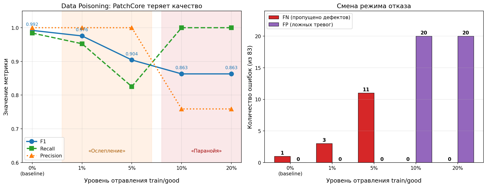
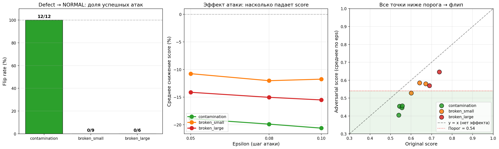
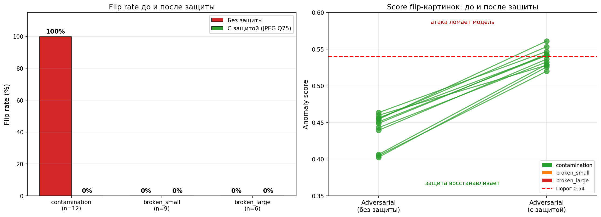
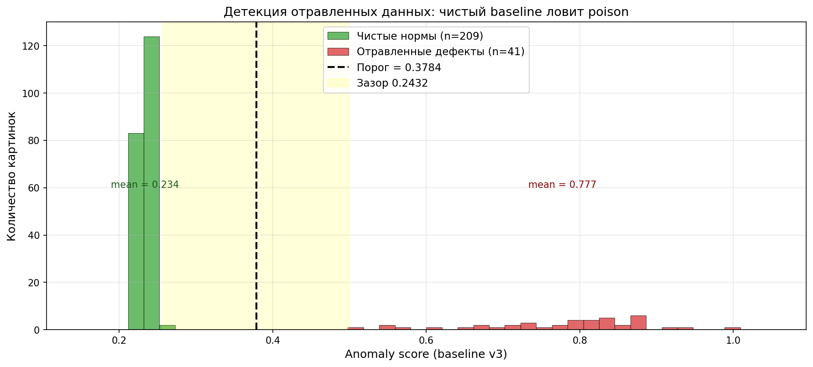
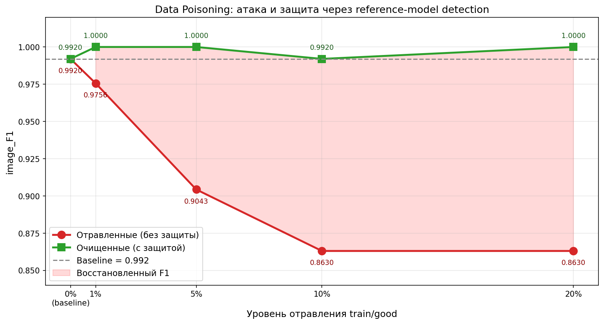
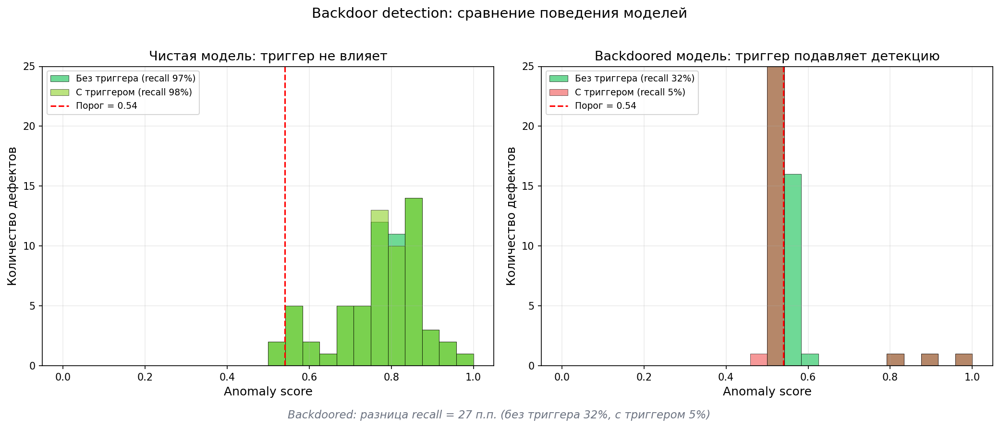

# ai-security-lab

Лаборатория атак на memory-bank anomaly detector (PatchCore).

## Что это

Исследование устойчивости PatchCore (WideResNet50 + memory bank)
к атакам на данные и на входное изображение.

**Модель-жертва:** [defect-detection](https://github.com/Vaks911/defect-detection)

## Статус

- [x] Baseline зафиксирован
- [x] Data Poisoning
- [x] Adversarial Attack
- [x] Митигации (JPEG-защита + очистка данных)
- [x] Backdoor Attack
## Структура

- `baseline/` — скрипты замера исходных метрик
- `src/` — скрипты атак, защиты и оценки
- `results/` — метрики, графики, чекпоинты
- `reports/` — итоговый отчёт
- `notes.md` — рабочий дневник

---

## Baseline

Метрики чистой модели PatchCore на MVTec AD (bottle), 83 тестовых изображения.

| Метрика | Значение |
|---|---|
| image_F1 | **0.9920** |
| accuracy | 0.9880 |
| порог модели | между 0.49999 и 0.53993 |
| слабый класс | `contamination` (recall 0.952) |

Полные данные: `results/baseline_metrics.json`, `results/baseline_per_image.csv`.  
Дневник эксперимента: `notes.md`.

---

## Data Poisoning

Атака на память PatchCore через отравление `train/good/` — дефектные
изображения помечаются как «норма» и попадают в memory bank.

| Run | F1 | Recall | Precision | FN | FP |
|---|---:|---:|---:|---:|---:|
| baseline | 0.9920 | 0.9841 | 1.0000 | 1 | 0 |
| 1% | 0.9756 | 0.9524 | 1.0000 | 3 | 0 |
| 5% | 0.9043 | 0.8254 | 1.0000 | 11 | 0 |
| 10% | 0.8630 | 1.0000 | 0.7590 | 0 | 20 |
| 20% | 0.8630 | 1.0000 | 0.7590 | 0 | 20 |

**Два режима отказа:**

- **1–5% — «ослепление»:** модель пропускает дефекты (FN растёт), ложных тревог нет. Опаснее для производства.
- **10–20% — «паранойя»:** модель ловит всё, включая норму (FP = 20). Опаснее для экономики.



*Слева: F1/Recall/Precision — переход от «ослепления» к «паранойе» на 10%.  
Справа: FN vs FP — визуальная смена режима отказа.*

---

## Adversarial Attack

Атака в feature-space backbone. Цель — сдвинуть фичи дефекта к среднему нормы,
чтобы модель назвала его NORMAL.

**Метод:** PGD (100 шагов, eps ∈ {0.05, 0.08, 0.10}) через `FeatureListNet`.
Loss = MSE(features, mean_normal_features).

**Результат:** 12/27 flip (**44.4%**). Все 4 `contamination` переключились при eps=0.05.

| Класс | Средний orig score | Flip rate |
|---|---:|---:|
| contamination | 0.50–0.56 | **12/12 (100%)** |
| broken_small | 0.60–0.67 | 0/9 (0%) |
| broken_large | 0.69–0.74 | 0/6 (0%) |



*Слева: flip rate по классам. В центре: снижение score по eps.  
Справа: scatter orig vs adv, зелёная зона — область flip.*

**Ключевой вывод:** атака эффективна только у границы решения.

---

## Митигации

Две защиты, по одной на каждую атаку.

### 1. Adversarial — JPEG-защита входа

Adversarial-шум — высокочастотные колебания пикселей. JPEG Q75 их стирает, глаз разницы не видит.

| | Flip rate |
|---|---:|
| Без защиты | **12/27 (44.4%)** |
| С защитой (JPEG Q75) | **0/27 (0.0%)** |



*Слева: flip rate по классам до/после. Справа: score flip-картинок — все поднялись выше порога 0.54.*

### 2. Data Poisoning — очистка через reference-model

Чистый baseline v3 даёт низкий anomaly score настоящим нормам (0.22–0.26)
и высокий — подложенным дефектам (0.50–1.00). Разделяем порогом 0.378.



*Чистые нормы (зелёные) — 0.22–0.26. Отравленные (красные) — 0.50–1.00.  
Порог 0.378 даёт FPR = 0%, Recall = 100%.*

Очищенный датасет → переобучение PatchCore. Результат:

| Уровень | poisoned F1 | cleaned F1 | Δ |
|---|---:|---:|---:|
| 1% | 0.9756 | **1.0000** | +0.0244 |
| 5% | 0.9043 | **1.0000** | +0.0957 |
| 10% | 0.8630 | **0.9920** | +0.1290 |
| 20% | 0.8630 | **1.0000** | +0.1370 |



*Красная линия — F1 отравленных моделей. Зелёная — после очистки.  
Розовая заливка — «восстановленный F1».*

**Защита полностью восстановила модель** на всех 4 уровнях. Три из четырёх — до идеального F1 = 1.0000.

---

## 🛠 Технологии

- **Python 3.11**, PyTorch 2.x (CPU)
- **Anomalib 1.1.0** — фреймворк anomaly detection
- **PatchCore** (CVPR 2022) — алгоритм memory bank
- **WideResNet50** — backbone
- **NumPy, Pillow, Matplotlib** — обработка и визуализация

## 🚀 Воспроизведение

### 1. Окружение

```
python -m venv venv311
venv311\Scripts\activate
pip install -r requirements.txt
```

### 2. Baseline

```
python baseline\baseline.py
```

### 3. Data Poisoning

```
python src\poison.py
python src\train_poisoned.py
python src\evaluate_all.py
python src\plot_poison.py
```

### 4. Adversarial Attack

```
python src\recon_patchcore.py
python src\adversarial_attack.py
python src\plot_adversarial.py
```

### 5. Защита от Adversarial

```
python src\defense.py
python src\evaluate_defense.py
python src\plot_defense.py
```

### 6. Защита от Data Poisoning

```
python src\detect_poison.py
python src\plot_detection.py
python src\clean_dataset.py
python src\train_cleaned.py
python src\plot_mitigation.py
```

---

## 📁 Структура проекта

```
ai-security-lab/
├── baseline/
│   └── baseline.py                # Замер метрик с EVAL_NAME
├── src/
│   ├── poison.py                  # Создание отравленных датасетов
│   ├── train_poisoned.py          # Обучение на отравленных данных
│   ├── evaluate_all.py            # Прогон baseline.py по всем уровням
│   ├── plot_poison.py             # График Data Poisoning
│   ├── recon_patchcore.py         # Разведка структуры PatchCore
│   ├── adversarial_attack.py      # PGD feature-space атака
│   ├── plot_adversarial.py        # График Adversarial Attack
│   ├── defense.py                 # JPEG-защита входа
│   ├── evaluate_defense.py        # Оценка защиты от Adversarial
│   ├── plot_defense.py            # График до/после защиты
│   ├── detect_poison.py           # Детекция отравленных примеров
│   ├── plot_detection.py          # Гистограмма чистые vs отравленные
│   ├── clean_dataset.py           # Очистка датасетов
│   ├── train_cleaned.py           # Обучение на очищенных данных
│   └── plot_mitigation.py         # Финальный график атака vs защита
├── results/
│   ├── baseline_metrics.json
│   ├── poison_summary.json
│   ├── poison_plot.png
│   ├── adversarial_border.json
│   ├── adversarial_plot.png
│   ├── mean_normal_features.pt
│   ├── defense_results.json
│   ├── defense_plot.png
│   ├── poison_detection_20.json
│   ├── detection_plot.png
│   ├── cleaned_XX_metrics.json
│   └── mitigation_plot.png
├── notes.md                       # Рабочий дневник
├── requirements.txt
└── README.md
```

---

## 🎯 Дальше

- [ ] **Adversarial Patch:** наклейка на бутылку, которая «гасит» детекцию.
- [ ] **Black-box атака:** без доступа к градиентам (transfer attack).
- [ ] **Adversarial Training:** более надёжная защита, чем JPEG.

---
## Backdoor Attack

Атака через триггер-патч: жёлтый квадрат 64×64 в правом верхнем углу.

**Метод:** 60 дефектных картинок с триггером подложены в `train/good/` под меткой «норма». Патчи триггера попадают в memory bank. На инференсе: картинка с триггером → низкий score → модель пропускает дефект.

**Результат на 63 дефектах:**

| Модель | Триггер | Recall |
|---|---:|---:|
| Чистая | нет | 0.968 |
| Чистая | да | 0.984 |
| Backdoored | нет | **0.317** |
| Backdoored | да | **0.048** |



*Слева: чистая модель — триггер не влияет. Справа: backdoored — с триггером recall падает с 32% до 5%.*

**Ключевой вывод:** триггер специфичен для backdoored-модели. Чистая на него не реагирует, backdoored — теряет 27 п.п. recall. Это доказывает, что backdoor укоренился.

**Ограничение:** 60 отравленных примеров привели к общей деградации модели (recall без триггера 0.32). В реальной атаке использовали бы 5–10 примеров. Но для проверки механизма этого достаточно.

---
## Автор

Максим Нагайцев — [GitHub](https://github.com/Vaks911) · [LinkedIn](https://www.linkedin.com/in/maksim-nagaytsev-ab2311432)